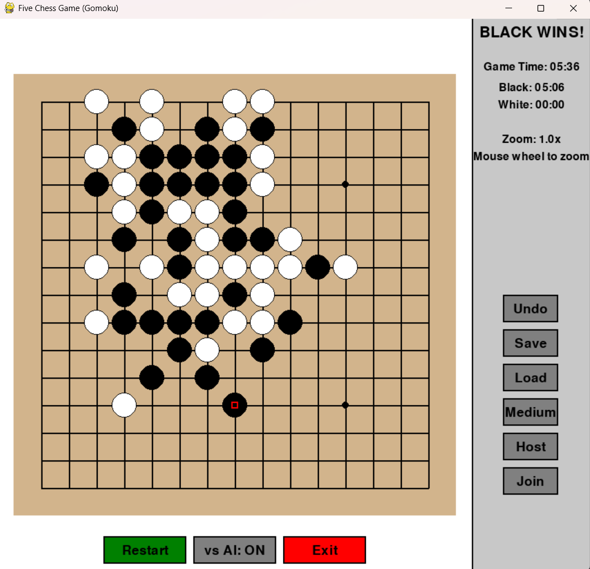

# Five Chess Game (Gomoku)

A Python implementation of the classic Gomoku (Five in a Row) game with an AI opponent option.



## Description

Five Chess Game is a strategic board game also known as Gomoku or Five in a Row. The objective is simple: be the first player to form an unbroken chain of five stones horizontally, vertically, or diagonally on the 15×15 board.

### Features

- Clean and intuitive graphical user interface using Pygame
- 15×15 standard Gomoku board
- Play against AI or another player
- AI opponent with strategic move evaluation
- Visual highlighting of the last move
- Game status display showing current player or winner
- Easy-to-use controls with button interface

## Installation

### Prerequisites

- Python 3.6 or higher
- Pygame library

### Setup

1. Clone this repository:
   ```
   git clone https://github.com/JackCaiZhang/FiveChessGame.git
   cd FiveChessGame
   ```

2. Install the required dependencies:
   ```
   pip install pygame
   ```

3. Run the game:
   ```
   python five_chess_game.py
   ```

## How to Play

1. **Starting the Game**: Run the Python script to launch the game. By default, you play as black stones against the AI (white stones).

2. **Placing Stones**: Click on any intersection on the board to place your stone. The game automatically alternates turns between players.

3. **Game Modes**:
   - **vs AI**: Play against the computer AI (default mode)
   - **vs Player**: Play against another human player on the same computer

4. **Controls**:
   - **Mouse Click**: Place a stone on the board
   - **"vs AI" Button**: Toggle between AI and human opponent
   - **Restart Button**: Start a new game
   - **Exit Button**: Quit the game
   - **R Key**: Alternative way to restart the game

5. **Winning**: The first player to form an unbroken line of five stones horizontally, vertically, or diagonally wins the game.

## Game AI

The AI opponent evaluates potential moves based on several factors:
- Winning opportunities
- Blocking opponent's winning moves
- Pattern recognition for potential line formations
- Board position evaluation (center positions are preferred)
- Proximity to existing pieces

The AI includes a small randomization factor to make gameplay less predictable.

## Technical Details

- Built with Python and Pygame
- Object-oriented design with Game and Button classes
- 15×15 grid board implementation
- Efficient win-checking algorithm

## License

This project is licensed under the MIT License - see the LICENSE file for details.

## Acknowledgments

- Inspired by the traditional Gomoku game
- Thanks to the Pygame community for the excellent game development library

## Features

### Recently Added Features

- **Difficulty Levels for AI**: Choose between Easy, Medium, and Hard difficulty levels to match your skill level
- **Game Timer**: Track both overall game time and individual player times
- **Move History and Undo**: Revert to previous game states with the undo functionality
- **Save/Load Game State**: Save your current game and continue it later
- **Network Multiplayer**: Play against friends over a local network

### Planned Future Improvements

- Enhanced AI algorithms
- Online multiplayer with matchmaking
- Replay system for reviewing games
- Customizable board themes
- Mobile version